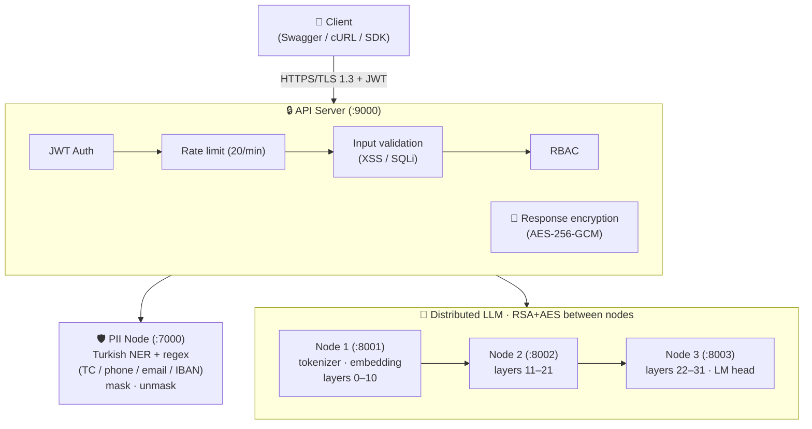

# 🔐 D-TEK: Distributed Secure LLM

<div align="center">


**A secure LLM system split across 3 nodes, fully encrypted and PII-protected**

</div>

## 🎯 What is it?

A secure LLM system whose model layers are split across 3 separate nodes. No single node can run
the model on its own. All communication is encrypted, and PII is masked automatically.

## ✨ Features

- ✅ **3-node distributed** → the model is partitioned; no single node can run it
- ✅ **Multi-layer encryption** → TLS + RSA-2048 + AES-256-GCM
- ✅ **PII protection** → automatic masking of TC-ID, phone, email, IBAN
- ✅ **JWT authentication** → secure identity verification
- ✅ **RBAC** → role-based access control
- ✅ **Rate limiting** → DDoS protection
- ✅ **Audit logging** → KVKK/GDPR-compliant

## 🏗️ Architecture



## 🔐 Security

| # | Layer | Technology | Description |
|---|-------|------------|-------------|
| 1 | **Transport** | HTTPS/TLS 1.3 | Encrypted Client↔API communication |
| 2 | **Authentication** | JWT (HS256) | 60-minute token |
| 3 | **Rate limiting** | 20 req/min | DDoS protection |
| 4 | **Input validation** | Regex + sanitization | XSS, SQLi, prompt injection |
| 5 | **Response encryption** | AES-256-GCM | Encrypted responses |
| 6 | **Node↔node crypto** | RSA-2048 + AES-256 | Encrypted hidden states |
| 7 | **PII protection** | NER + regex | TC-ID, phone, email, IBAN |
| 8 | **RBAC** | Role-based | admin, user, pilot, readonly |
| 9 | **Session management** | Timeout | 60-min inactivity |
| 10 | **Audit logging** | SHA-256 | KVKK/GDPR-compliant logs |

**Security score: 9.4/10** ✅

## 📦 Setup

```bash
# 1. Clone
git clone https://github.com/yagmurtncr/dsi.git
cd dsi

# 2. Dependencies
pip install -r requirements.txt

# 3. Environment
cp .env.example .env
nano .env  # edit

# 4. SSL
mkdir -p certs
openssl req -x509 -newkey rsa:4096 -nodes \
  -keyout certs/key.pem -out certs/cert.pem -days 365

# 5. Model (Hugging Face)
huggingface-cli download meta-llama/Llama-3.1-8B-Instruct \
  --local-dir models/llama-3.1-8b-instruct
```

## 🚀 Running

```bash
# Start the nodes (4 terminals)
python3 src/node1_embedder.py
python3 src/node2_processor.py
python3 src/node3_head.py
python3 src/pii_node_server.py

# Start the API (5th terminal)
python3 src/api_secure_v2.py

# Test
./test_manual.sh
```

**Swagger UI:** https://localhost:9000/docs
**Demo login:** `yagmur` / `yagmur123`

## 📡 API

```bash
# Login
curl -sk -X POST https://localhost:9000/login \
  -d '{"username":"yagmur","password":"yagmur123"}'

# Generate
curl -sk -X POST https://localhost:9000/generate \
  -H "Authorization: Bearer <TOKEN>" \
  -d '{"prompt":"Hello","max_tokens":50}'
```

| Endpoint | Method | Description |
|----------|--------|-------------|
| `/login` | POST | Get a JWT token |
| `/generate` | POST | Text generation |
| `/health` | GET | System status |

## 📁 Structure

```
src/
├── api_secure_v2.py           # API server
├── node1_embedder.py          # Node 1 (layers 0–10)
├── node2_processor.py         # Node 2 (layers 11–21)
├── node3_head.py              # Node 3 (layers 22–31)
├── pii_node_server.py         # PII detection
└── security/                  # security modules
```

## 📚 Documentation

- [D-TEK Pipeline](D-TEK_PIPELINE.md) — detailed system pipeline
- [Security Report](GUVENLIK_RAPORU.md) — comprehensive security analysis

## 👤 Author

**Nur Yağmur Tuncer**

## 📄 License

MIT License
